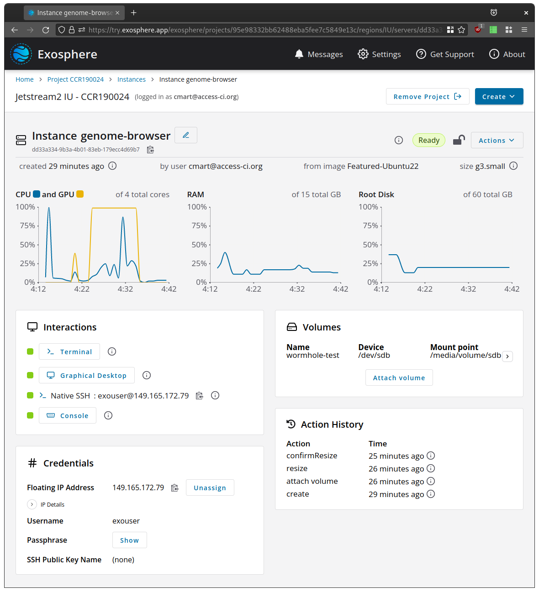

# Exosphere: the User-Friendliest Interface for Non-proprietary Cloud Infrastructure

- Empowers researchers and other non-IT professionals to deploy their code and run services on [OpenStack](https://www.openstack.org)-based cloud infrastructure without advanced knowledge of virtualization or networking concepts
- Fills the gap between interfaces built for system administrators like OpenStack Horizon, and intuitive-but-proprietary services like DigitalOcean
- Enables cloud operators to deliver a user-friendly, powerful interface to their community with customized branding, nomenclature, and single sign-on integration

[](docs/assets/screenshot-for-readme.png)

## Video presentation and demo

[](https://www.youtube.com/watch?v=CTL-6icekYQ)

## Quick Start

- **[try.exosphere.app](https://try.exosphere.app)** in your browser, if you have access to an existing OpenStack cloud with internet-facing APIs
- Use **[jetstream2.exosphere.app](https://jetstream2.exosphere.app)** if you have an allocation on [Jetstream2](https://jetstream-cloud.org/)

## Overview and Features

_Wait, what is OpenStack?_ OpenStack is the operating system and APIs that power public research clouds at [Jetstream](https://jetstream-cloud.org) and [CyVerse](https://cyverse.org),  private clouds at organizations like [Wikimedia](https://www.mediawiki.org/wiki/Wikimedia_Cloud_Services_team) and [CERN](https://clouddocs.web.cern.ch/), and public commercial clouds like [OVH](https://us.ovhcloud.com/public-cloud/), [Fuga](https://fuga.cloud/), and [Vexxhost](https://vexxhost.com/). You can also run OpenStack on your own hardware to provide cloud infrastructure-as-a-service for your organization!

_OK, what can I do with Exosphere?_

- Easily create instances to run your code, and volumes to manage your data
  - Works great for containers, intensive compute jobs, disposable experiments, and persistent web services
- Get **one-click, browser-based shell** access to cloud resources with Exosphere's [Apache Guacamole](http://guacamole.apache.org) integration
  - One-click **graphical desktop** as well! (for Ubuntu 20.04 and newer, Rocky Linux, and AlmaLinux)
- **Pretty graphs** show resource utilization of each instance at a glance
- If you're a cloud operator, deliver a customized interface with white-labeling, localized nomenclature, and single sign-on
- 100% self-hostable, 99% standalone client application
  - Two small proxy servers facilitate secure web browser connections to OpenStack APIs and services running on user-launched cloud instances
- On the roadmap:
  - First-class support for containers and data science workbenches
  - Cluster orchestration
  - Community-curated deployment automations for scientific workflows and custom services
- Fully open source and open development process -- come hack with us!
  - See Exosphere's [values and goals](values-goals.md)
  
Exosphere will be a primary user interface for [Jetstream 2](https://itnews.iu.edu/articles/2020/NSF-awards-IU-10M-to-build-Jetstream-2-cloud-computing-system-.php), an [NSF](https://www.nsf.gov)-funded science and engineering cloud. Jetstream 2 will be available to any US-based researcher starting late 2021.

## Collaborate With Us

To start a conversation or ask for help, talk to us in real-time on [Matrix / Element](https://riot.im/app/#/room/#exosphere:matrix.org). You can also [browse an archive](https://view.matrix.org/room/!qALrQaRCgWgkQcBoKG:matrix.org/) of the chat history.

We use GitLab to track issues and contributions. To request a new feature or report a bug, [create a new issue](https://gitlab.com/exosphere/exosphere/-/issues/new) on our GitLab project.


We discuss project progress and priorities on a **weekly video call** Mondays at 16:00 UTC. The whole community is invited! Join at <https://meet.jit.si/exosphere>, or dial in at +1.512.647.1431, PIN: 3037 7824 88#. Find the agenda and notes from previous meetings [here](https://c-mart.sandcats.io/shared/wfRsWBVmJZ3maUn7HMFqNj_MR_Bzy1vob9CzWu1n7QI).

## Documentation

### For Users and Anyone Else

- [Nomenclature Reference](docs/nomenclature-reference.md)
- [Values and Goals of the Exosphere Project](values-goals.md)
- [Cockpit Deprecation and Manual Installation](docs/cockpit.md)
- [Installing Exosphere Progressive Web Application](docs/pwa-install.md)
- [Exosphere Compatibility](docs/compatibility.md) (with clouds and instance operating systems)

### For Cloud Operators

- [Configuration Options](docs/config-options.md)
- [User Application Proxy (UAP)](docs/user-app-proxy.md)
- [Solving the CORS Problem (Cloud CORS Proxy)](docs/solving-cors-problem.md)
- [Configuring Instance Types](docs/instance-types.md)
- [Message for desktop environment users](docs/desktop-message.md)
- [Federated Login Support](docs/federated-login.md)

### For Exosphere Contributors

- [Contributing to Exosphere](contributing.md)
- [Tour of Exosphere Codebase](docs/code-tour.md)
- [UI, Layout, Style & Design System](docs/style.md)
- [Architecture Decision Records](docs/adr/README.md)
- [Exosphere Tests](tests/README.md)
- [Browser Integration Tests](integration-tests/README.md)

### Legal Docs

- [Exosphere Project License](LICENSE)
- [Acceptable Use Policy for Exosphere Hosted Sites](docs/acceptable-use-policy.md)
- [Privacy Policy for Exosphere Hosted Sites](docs/privacy-policy.md)

## Advanced Topics

The following techniques are intended for cloud operators, advanced users, and for development purposes. We suggest that new users start with one of the hosted applications linked above.

### Docker

You can run Exosphere using a Docker container. The Docker container includes a Cloud CORS Proxy (CCP) through which Exosphere communicates with OpenStack API endpoints. This has the following benefits:

1. You can use Exosphere to access OpenStack APIs which are not accessible from outside an organization's secure network (as long as the computer running the container can access the OpenStack APIs)
2. Your cloud credentials will never pass through the proxy servers managed by the Exosphere project for the convenience of most users

Note: See [solving-cors-problem.md](docs/solving-cors-problem.md) for background information about the Cloud CORS Proxy (CCP). 

#### Use an official Exosphere container image

```bash
docker run --publish 127.0.0.1:8000:8000 registry.gitlab.com/exosphere/exosphere
```

Open URL in a browser: <http://127.0.0.1:8000/> 

#### Build a container image from the source code

```bash
git clone https://gitlab.com/exosphere/exosphere.git
cd exosphere
docker build -t exosphere -f ./docker/standalone.Dockerfile .
docker run --publish 127.0.0.1:8000:8000 exosphere
```

Open URL in a browser: <http://127.0.0.1:8000/>

#### Use Docker when developing Exosphere

If you want to work on the Exosphere code but do not want to install `node` on your system, then you can use the [Dockerfile](Dockerfile) in the root directory of the repository to build a development container instead. 

First, build the container:

```bash
docker build -t exosphere .
```

And then run, binding port 8000 to 8000 in the container:

```bash
docker run --rm -it --name exosphere --publish 127.0.0.1:8000:8000 exosphere
```

You should see `elm-live` starting:

```
elm-live:
  Hot Reloading is ON

  Warning: Hot Reloading does not replay the messages of the app.
  It just restores the previous state and can lead to bad state.
  If this happen, reload the app in the browser manually to fix it.


elm-live:
  Server has been started! Server details below:
    - Website URL: http://0.0.0.0:8000
    - Serving files from: /usr/src/app
    - Proxying requests starting with /proxy to https://try-dev.exosphere.app/proxy

elm-live:
  The build has succeeded. 

elm-live:
  Watching the following files:
    - src/**/*.elm
```

You can open your browser to [http://app.exosphere.localhost:8000/](http://app.exosphere.localhost:8000/) to see the interface.

If you want a development environment to make changes to files, you can run
the container and bind the src directory:

```bash
$ docker run --rm -v $PWD/src:/usr/src/app/src -it --name exosphere -p 8000:8000 exosphere
```

You can then edit the Elm source code on your host using your favorite editor and `elm-live` inside the container will
detect the changes, automatically recompile the source code, and then reload the app in your browser.

If you need changes done to other files in the root, you can either bind them
or make changes and rebuild the base. You generally shouldn't make changes to files
from inside the container that are bound to the host, as the permissions will be
modified.

If you want to copy the elm-web.js from inside the container (or any other file) you can do the following in another
terminal window:

```bash
docker cp exosphere:/usr/src/app/elm-web.js my-elm.js
```

When it's time to cleanup, press Ctrl-C in the terminal window running `elm-live`.

### Build and Run Exosphere Locally (not using Docker)

First [install node.js + npm](https://www.npmjs.com/get-npm).

- If you use Ubuntu/Debian you may also need to `apt-get install nodejs-legacy`.
- If you are using Mac OS X, you may need to add `127.0.0.1       app.exosphere.localhost` to `/etc/hosts`

Then install the project's dependencies (including Elm). Convenience command to do this (run from the root of the exosphere repo):

```bash
npm install
```

To compile the app and serve it using a local development server run this command:

```
npm start
```

Then browse to <http://app.exosphere.localhost:8000/>

To enable the Elm Debugger in the local development server run the following command instead:

```
npm run live-debug
```

Note: The local development server uses elm-live. It detects changes to the Exosphere source code, recompiles it, and
refreshes the browser with the latest version of the app. See [elm-live.com](https://www.elm-live.com/) for more
information.

### To host the Exosphere Web Application

- The Exosphere client-side application can be served as static content from any web server.
- Exosphere's two supporting proxy servers ([Cloud CORS Proxy](docs/solving-cors-problem.md) and [User Application Proxy](docs/user-app-proxy.md)) require [Nginx](https://nginx.org) configured with browser-accepted TLS (e.g. via [Let's Encrypt](https://letsencrypt.org)). The User Application Proxy requires a wildcard TLS certificate; Let's Encrypt issues these free of charge.

### Instance Setup Code

Exosphere uses Ansible to configure and provision new instances. (Among other things, it installs and configures Docker and Apache Guacamole server for the one-click terminal and remote desktop environment.) The setup code is stored in the `ansible/` directory of the Exosphere repository.

By default, new instances pull this code from the master branch of the upstream [exosphere/exosphere](https://gitlab.com/exosphere/exosphere/) repository. This is true even for instances which are launched using a different branch or fork of Exosphere.

You may wish to configure Exosphere to deploy instances using your own (modified) instance setup code, for development/testing purposes or as customized for your own organization. To do that, you must push the code to a git repository somewhere that new instances can download from, and then set two options in `config.js`:

- `instanceConfigMgtRepoUrl` to the git repository URL that new instances can download your setup code from
- `instanceConfigMgtRepoCheckout` to the repository branch/tag/commit that should be checked out (defaults to master if left `null`)

Note that Exosphere downloads the specified repo and runs the playbook stored at `ansible/playbook.yml`, so implement your changes by modifying that playbook.

---

To test the instance setup code locally on a cloud instance, do this:
```
virtualenv /opt/ansible-venv
. /opt/ansible-venv/bin/activate
pip install ansible-core
ansible-pull --url https://gitlab.com/exosphere/exosphere.git --directory /opt/instance-config-mgt -i /opt/instance-config-mgt/ansible/hosts /opt/instance-config-mgt/ansible/playbook.yml
```

Optionally, pass the `--checkout` argument to specify a git branch/tag or commit hash.

For now, we are using only [built-in Ansible modules](https://docs.ansible.com/ansible/latest/collections/ansible/builtin/#modules), because Exosphere uses the lightweight `ansible-core` package.

#### Ansible variables currently used

Exosphere sets these variables when running the instance setup code on a new instance.

| variable     | type    | required | description                                                             |
|--------------|---------|----------|-------------------------------------------------------------------------|
| guac_enabled | boolean | no       | deploys Apache Guacamole to serve terminal (and optionally desktop)     |
| gui_enabled  | boolean | no       | deploys VNC server, configures Guacamole to serve graphical desktop     |
