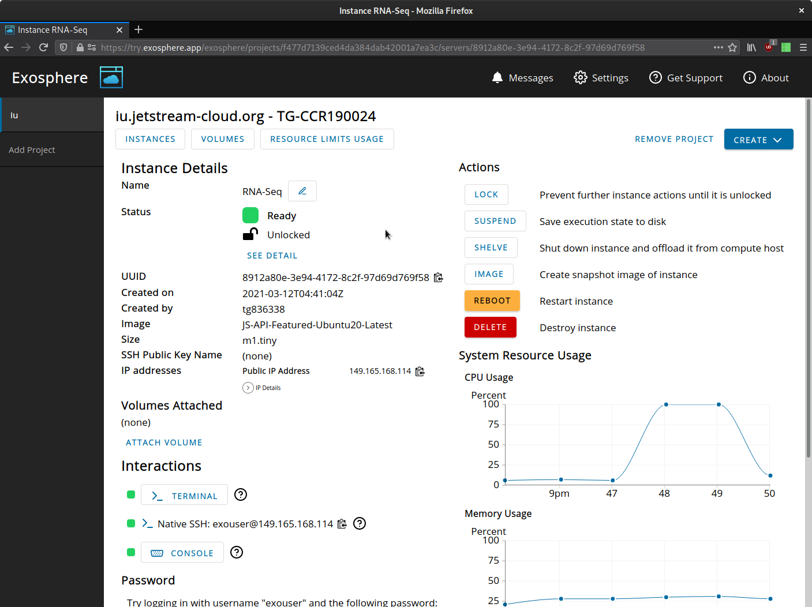

# Exosphere: the User-Friendliest Interface for Non-proprietary Cloud Infrastructure

- Empowers researchers and other non-IT professionals to deploy their code and run services on [OpenStack](https://www.openstack.org)-based cloud infrastructure without advanced knowledge of virtualization or networking concepts
- Fills the gap between interfaces built for system administrators like OpenStack Horizon, and intuitive-but-proprietary services like DigitalOcean
- Enables cloud operators to deliver a user-friendly, powerful interface to their community with customized branding, nomenclature, and single sign-on integration

[](docs/screenshot-for-readme.png)

## Video presentation and demo

[](https://www.youtube.com/watch?v=CTL-6icekYQ)

## Quick Start

- **[try.exosphere.app](https://try.exosphere.app)** in your browser, if you have access to an existing OpenStack cloud with internet-facing APIs
- Use **[exosphere.jetstream-cloud.org](https://exosphere.jetstream-cloud.org)** if you have an allocation on [Jetstream Cloud](https://jetstream-cloud.org/)

## Overview and Features

_Wait, what is OpenStack?_ OpenStack is the operating system and APIs that power public research clouds at [Jetstream](https://jetstream-cloud.org) and [CyVerse](https://cyverse.org),  private clouds at organizations like [Wikimedia](https://www.mediawiki.org/wiki/Wikimedia_Cloud_Services_team) and [CERN](https://clouddocs.web.cern.ch/), and public commercial clouds like [OVH](https://us.ovhcloud.com/public-cloud/), [Fuga](https://fuga.cloud/), and [Vexxhost](https://vexxhost.com/). You can also run OpenStack on your own hardware to provide cloud infrastructure-as-a-service for your organization!

_OK, what can I do with Exosphere?_

- Easily create instances to run your code, and volumes to manage your data
  - Works great for containers, intensive compute jobs, disposable experiments, and persistent web services
- Get **one-click, browser-based shell** access to cloud resources with Exosphere's [Apache Guacamole](http://guacamole.apache.org) integration
  - One-click **graphical desktop** as well! (alpha feature for CentOS 8)
- **Pretty graphs** show resource utilization of each instance at a glance
- If you're a cloud operator, deliver a customized interface with white-labeling, localized nomenclature, and single sign-on
- 100% self-hostable, 99% standalone client application
  - Two small proxy servers facilitate secure web browser connections to OpenStack APIs and services running on user-launched cloud instances
- On the roadmap:
  - First-class support for containers and data science workbenches
  - Cluster orchestration
  - Community-curated deployment automations for scientific workflows and custom services
- Fully open source and open development process -- come hack with us!
  - See Exosphere's [values and goals](values-goals.md)
  
Exosphere will be a primary user interface for [Jetstream 2](https://itnews.iu.edu/articles/2020/NSF-awards-IU-10M-to-build-Jetstream-2-cloud-computing-system-.php), an [NSF](https://www.nsf.gov)-funded science and engineering cloud. Jetstream 2 will be available to any US-based researcher starting late 2021.

## Collaborate With Us

To start a conversation or ask for help, talk to us in real-time on [Matrix / Element](https://riot.im/app/#/room/#exosphere:matrix.org). You can also [browse an archive](https://view.matrix.org/room/!qALrQaRCgWgkQcBoKG:matrix.org/) of the chat history.

We use GitLab to track issues and contributions. To request a new feature or report a bug, [create a new issue](https://gitlab.com/exosphere/exosphere/-/issues/new) on our GitLab project.

See [contributing.md](contributing.md) for contributor guidelines.

Architecture decisions are documented in [docs/adr/README.md](docs/adr/README.md).

If you want to work on the application UI and styling, see [style.md](docs/style.md) for an orientation.

## Advanced Topics

The following techniques are intended for cloud operators, advanced users, and for development purposes. We suggest that new users start with one of the hosted applications linked above.

### Build and Run Exosphere Locally

If you are building Exosphere for consumption in a web browser, please also see [solving-cors-problem.md](docs/solving-cors-problem.md).

First [install node.js + npm](https://www.npmjs.com/get-npm). (If you use Ubuntu/Debian you may also need to `apt-get install nodejs-legacy`.)

Then install the project's dependencies (including Elm). Convenience command to do this (run from the root of the exosphere repo):

```bash
npm install
```

To compile the app and serve it using a local development server install `elm-live` (once only):

```
npm install --no-save elm-live
```

Then run this command:

```
npm run live
```

Then browse to <http://app.exosphere.localhost:8000/>

To enable the Elm Debugger in the local development server run the following command instead:

```
npm run live-debug
```

Note: The local development server uses elm-live. It detects changes to the Exosphere source code, recompiles it, and
refreshes the browser with the latest version of the app. See [elm-live.com](https://www.elm-live.com/) for more
information.

### Build and Run Exosphere with Docker

If you want to build exosphere (as shown above) for a browser but do not want
to install node on your system, you can use the [Dockerfile](Dockerfile)
to build a container instead. First, build the container:

```bash
docker build -t exosphere .
```

And then run, binding port 8000 to 8000 in the container:

```bash
docker run --rm -it --name exosphere -p 8000:8000 exosphere
```

You should see `elm-live` starting:

```
elm-live:
  Hot Reloading is ON

  Warning: Hot Reloading does not replay the messages of the app.
  It just restores the previous state and can lead to bad state.
  If this happen, reload the app in the browser manually to fix it.


elm-live:
  Server has been started! Server details below:
    - Website URL: http://0.0.0.0:8000
    - Serving files from: /usr/src/app
    - Proxying requests starting with /proxy to https://try-dev.exosphere.app/proxy

elm-live:
  The build has succeeded. 

elm-live:
  Watching the following files:
    - src/**/*.elm
```

You can open your browser to [http://app.exosphere.localhost:8000/](http://app.exosphere.localhost:8000/) to see the interface.

If you want a development environment to make changes to files, you can run
the container and bind the src directory:

```bash
$ docker run --rm -v $PWD/src:/usr/src/app/src -it --name exosphere -p 8000:8000 exosphere
```

You can then edit the Elm source code on your host using your favorite editor and `elm-live` inside the container will
detect the changes, automatically recompile the source code, and then reload the app in your browser.

If you need changes done to other files in the root, you can either bind them
or make changes and rebuild the base. You generally shouldn't make changes to files
from inside the container that are bound to the host, as the permissions will be
modified.

If you want to copy the elm-web.js from inside the container (or any other file) you can do the following in another
terminal window:

```bash
docker cp exosphere:/usr/src/app/elm-web.js my-elm.js
```

When it's time to cleanup, press Ctrl-C in the terminal window running `elm-live`.

### Exosphere Compatibility

#### To use with an OpenStack Cloud

- Exosphere works with OpenStack Queens version (released February 2018) or later.
- Exosphere works best with clouds that have [automatic allocation of network topology](https://docs.openstack.org/neutron/latest/admin/config-auto-allocation.html) enabled.

#### Supported Instance Operating Systems

Exosphere works best with instances launched from images based on **Ubuntu 20.04 LTS and CentOS 8**. Ubuntu 18.04 and CentOS 7 are also supported, but they receive less attention when testing new features. Exosphere can launch instances that run other operating systems, but some features and integrations are likely to not work.

One exception to the above: the one-click graphical desktop feature, currently in alpha stage, only works with CentOS 8.

If your community relies on an operating system that we don't currently support, please [create an issue](https://gitlab.com/exosphere/exosphere/-/issues) explaining your need! It's probably not hard to add support for Linux distros that use systemd and an APT/YUM/DNF package system.

#### To host the Exosphere Web Application  

- The Exosphere client-side application can be served as static content from any web server.
- Exosphere's two supporting proxy servers ([Cloud CORS Proxy](docs/solving-cors-problem.md) and [User Application Proxy](docs/user-app-proxy.md)) require [Nginx](https://nginx.org) configured with browser-accepted TLS (e.g. via [Let's Encrypt](https://letsencrypt.org)). The User Application Proxy requires a wildcard TLS certificate; Let's Encrypt issues these free of charge.

### Runtime configuration options

These options are primarily intended for cloud operators who wish to offer a customized deployment of Exosphere to their user community. Set these in `config.js`.

| *Option*                      | *Possible Values*          | *Description*                                                          |
|-------------------------------|----------------------------|------------------------------------------------------------------------|
| showDebugMsgs                 | false, true                |                                                                        |
| cloudCorsProxyUrl             | null, string               | See `docs/solving-cors-problem.md`; required to use app in web browser |
| clouds                        | list                       | See example below; required for Guacamole support                      |
| palette                       | null, JSON object          | Pass custom colors to style Exosphere, see example below               |
| logo                          | null, string               | Path to custom logo to show in top-left corner of app                  |
| favicon                       | null, string               | Path to custom favicon                                                 |
| appTitle                      | null, string               | Title to show in top-left corner of app                                |
| defaultLoginView              | null, openstack, jetstream | Which login view to display by default                                 |
| aboutAppMarkdown              | null, string (markdown)    | What to show in the "About the app" section of Help/About view         |
| supportInfoMarkdown           | null, string (markdown)    | What to show when user clicks "Get support" button                     |
| userSupportEmail              | null, string (markdown)    | Email address to ask users to send problem report                      |
| openIdConnectLoginConfig      | null, JSON object          | See `docs/federated-login.md` for more info and example JSON           |
| localization                  | null, JSON object          | Pass custom localization strings for the UI, see example below         |
| instanceConfigMgtRepoUrl      | null, string               | Set a custom repository to use for instance provisioning code          |
| instanceConfigMgtRepoCheckout | null, string               | Check out specific branch/tag/commit of instance provisioning code     |

#### Example cloud configuration

The `clouds` flag is a list containing JSON objects for each cloud with a custom configuration. Each of these JSON objects contains the following properties:

- `keystoneHostname` (string): Used to look up the custom configuration for a cloud, e.g. `openstack.example.cloud`
- `userAppProxy` (null, string): The hostname of the User Application proxy (UAP), e.g. `uap.openstack.example.cloud`. See `docs/user-app-proxy.md` for more information.
- `imageExcludeFilter` (null, JSON object): A key:value property to exclude images from UI, see example below
- `featuredImageNamePrefix` (null, string): A (public) image is 'featured' if the name starts with this string

```javascript
  clouds: [
    {
      keystoneHostname: "openstack.example.cloud",
      userAppProxy: "uap.openstack.example.cloud",
      imageExcludeFilter: null,
      featuredImageNamePrefix: null
    },
    {
      keystoneHostname: "iu.jetstream-cloud.org",
      userAppProxy: "proxy-j7m-iu.exosphere.app",
      imageExcludeFilter: {
        filterKey: "atmo_image_include",
        filterValue: "true"
      },
      featuredImageNamePrefix: "JS-API-Featured"
    }
  ]
```

##### Example Image Exclude Filter

This excludes images built by, and intended for the Atmosphere platform.

```
  imageExcludeFilter: {
    filterKey: "atmo_image_include",
    filterValue: "true"
  }
```

#### Example Custom Palette

This declares a primary and secondary color in the app.

```
palette: { primary: {r: 0, g: 108, b: 163 }, secondary : {r: 96, g: 239, b: 255 } } 
```

#### Example Localization JSON object

This allows a deployer to customize terms used by Exosphere for their organization or community.

```
localization: {
    openstackWithOwnKeystone: "cloud",
    openstackSharingKeystoneWithAnother: "region",
    unitOfTenancy: "project",
    maxResourcesPerProject: "resource limits",
    pkiPublicKeyForSsh: "SSH public key",
    virtualComputer: "instance",
    virtualComputerHardwareConfig: "size",
    cloudInitData: "boot script",
    commandDrivenTextInterface: "terminal",
    staticRepresentationOfBlockDeviceContents: "image",
    blockDevice: "volume",
    nonFloatingIpAddress: "internal IP address",
    floatingIpAddress: "floating IP address",
    publiclyRoutableIpAddress: "public IP address",
    graphicalDesktopEnvironment: "graphical desktop environment"
    }
```

### Instance Provisioning Code

Exosphere uses Ansible to configure and provision new instances. (Among other things, it installs and configures Docker and Apache Guacamole server for the one-click terminal and remote desktop environment.) The provisioning code is stored in the `ansible/` directory of the Exosphere repository.

By default, new instances pull this code from the master branch of the upstream [exosphere/exosphere](https://gitlab.com/exosphere/exosphere/) repository. This is true even for instances which are launched using a different branch or fork of Exosphere.

You may wish to configure Exosphere to deploy instances using your own (modified) instance provisioning code, for development/testing purposes or as customized for your own organization. To do that, you must push the code to a git repository somewhere that new instances can download from, and then set two options in `config.js`:

- `instanceConfigMgtRepoUrl` to the git repository URL that new instances can download your provisioning code from
- `instanceConfigMgtRepoCheckout` to the repository branch/tag/commit that should be checked out (defaults to master if left `null`)

Note that Exosphere downloads the specified repo and runs the playbook stored at `ansible/playbook.yml`, so implement your changes by modifying that playbook.

---

To test the instance provisioning code locally on a cloud instance, do this:
```
virtualenv /opt/ansible-venv
. /opt/ansible-venv/bin/activate
pip install ansible-base
ansible-pull --url https://gitlab.com/exosphere/exosphere.git --directory /opt/instance-config-mgt -i /opt/instance-config-mgt/ansible/hosts /opt/instance-config-mgt/ansible/playbook.yml
```

Optionally, pass the `--checkout` argument to specify a git branch/tag or commit hash.

For now, we are using only [built-in Ansible modules](https://docs.ansible.com/ansible/latest/collections/ansible/builtin/#modules), because Exosphere uses the lightweight `ansible-base` / `ansible-core` package.

#### Ansible variables currently used

Exosphere sets these variables when running the instance provisioning code on a new instance.

| variable     | type    | required | description                                                             |
|--------------|---------|----------|-------------------------------------------------------------------------|
| guac_enabled | boolean | no       | deploys Apache Guacamole to serve terminal (and optionally desktop)     |
| gui_enabled  | boolean | no       | deploys VNC server, configures Guacamole to serve graphical desktop     |