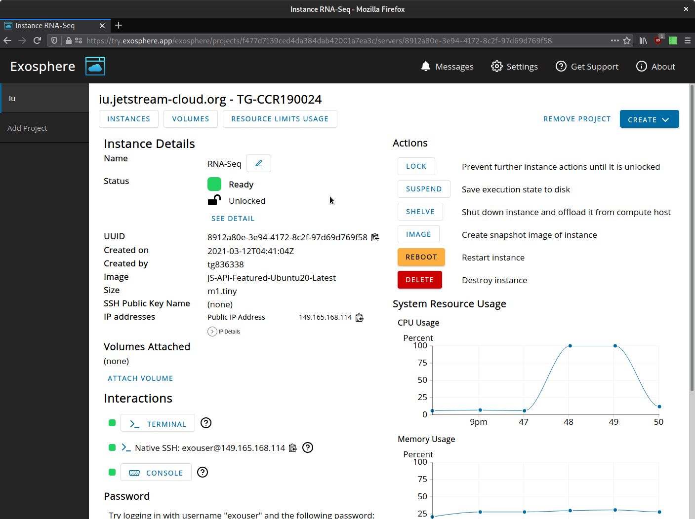

# Exosphere: the User-Friendliest Interface for Non-proprietary Cloud Infrastructure

- Empowers researchers and other non-IT professionals to deploy code and run services on [OpenStack](https://www.openstack.org)-based cloud systems, without advanced virtualization or networking knowledge
- Fills the gap between OpenStack interfaces built for system administrators (like [Horizon](https://docs.openstack.org/horizon/latest/)), and intuitive-but-proprietary services like [DigitalOcean](https://www.digitalocean.com/) and [Amazon Lightsail](https://aws.amazon.com/lightsail)
- Enables cloud operators to deliver a friendly, powerful interface to their community with customized branding, nomenclature, and single sign-on integration

Watch a [video presentation and demo](https://www.youtube.com/watch?v=CTL-6icekYQ):

## Try Exosphere

- Visit **[try.exosphere.app](https://try.exosphere.app)** if you have access to an existing OpenStack cloud with internet-facing APIs
- Use **[jetstream2.exosphere.app](https://jetstream2.exosphere.app)** if you have an allocation on [Jetstream2](https://jetstream-cloud.org/)
- [Run Exosphere locally](docs/run-exosphere.md) if you don't want to use our hosted site

## Overview and Features

_Wait, what is OpenStack? [OpenStack](http://openstack.org) is the operating system and APIs that power public research clouds like [Jetstream2](https://jetstream-cloud.org) and [Chameleon](https://www.chameleoncloud.org), private clouds at organizations like [Wikimedia](https://www.mediawiki.org/wiki/Wikimedia_Cloud_Services_team) and [CERN](https://clouddocs.web.cern.ch/), and public commercial clouds like [OVH](https://us.ovhcloud.com/public-cloud/), [Fuga](https://fuga.cloud/), [Vexxhost](https://vexxhost.com/), and [Leafcloud](https://leaf.cloud). Any organization can run OpenStack on its own hardware to provide a cloud service for its own community, or for the world._

What can I do with Exosphere?

- Create instances to run your code, and volumes to manage your data
  - Works great for containers, intensive compute jobs, disposable experiments, and persistent web services
- Get **one-click, browser-based shell and graphical desktop** access to cloud instances (via [Apache Guacamole](http://guacamole.apache.org))
- **Pretty graphs** show an instance's resource usage at a glance
- If you're a cloud operator, deliver a customized interface with white-labeling, localization, and single sign-on
- 100% self-hostable, 99% standalone client application
  - Two small proxy servers secure web browser connections to OpenStack APIs, and interactive services running on cloud instances
- On the [roadmap](https://gitlab.com/exosphere/exosphere/-/issues?label_name[]=long-term+goal):
  - First-class support for [container](https://gitlab.com/exosphere/exosphere/-/issues/82) and [data science workbench](https://gitlab.com/exosphere/exosphere/-/issues/717) resources
  - [Cluster orchestration](https://gitlab.com/exosphere/exosphere/-/issues/317)
  - [Community-curated deployment automations](https://gitlab.com/exosphere/exosphere/-/issues/573) for scientific workflows and custom services
- Free, open source, and open development process -- come hack with us!
  - See Exosphere's [values and goals](docs/values-goals.md)

## Documentation Index

### For Users and Anyone Else

- [Running Exosphere](docs/run-exosphere.md) yourself (instead of using one of the hosted sites)
- [Exosphere Compatibility](docs/compatibility.md) (with clouds and instance operating systems)
- [Values and Goals of the Exosphere Project](docs/values-goals.md)
- [Nomenclature Reference](docs/nomenclature-reference.md)
- [Installing Exosphere Progressive Web Application](docs/pwa-install.md)
- [Cockpit Deprecation and Manual Installation](docs/cockpit.md)
- [Graphical Acceleration](docs/graphical-acceleration.md)

### For Cloud Operators

- [Configuration Options](docs/config-options.md)
- [Instance Setup Code](docs/instance-setup.md)
- [Solving the CORS Problem (Cloud CORS Proxy)](docs/solving-cors-problem.md)
- [User Application Proxy (UAP)](docs/user-app-proxy.md)
- [Configuring Instance Types](docs/instance-types.md)
- [Message for desktop environment users](docs/desktop-message.md)
- [Federated Login Support](docs/federated-login.md)

### For Exosphere Contributors

- [Quick Start for New Contributors](docs/contributor-quick-start.md)
- [Contributing to Exosphere](contributing.md)
- [Contributor Skills](docs/contributor-skills.md)
- [Tour of Exosphere Codebase](docs/code-tour.md)
- [UI, Layout, Style & Design System](docs/style.md)
- [Contribution Review Policy](docs/review-policy.md)
- [Merge Request Quality Checklist](docs/quality-checklist.md)
- [Architecture Decision Records](docs/adr/README.md)
- [Exosphere Tests](tests/README.md)
- [Browser Integration Tests](integration-tests/README.md)
- [Performance Tests](performance-tests/README.md)
- [MkDocs Site](docs/mkdocs-site.md)
- [Code of Conduct](docs/code-of-conduct.md)

### For Exosphere Project Maintainers

- [Issue Triage Process](docs/issue-triage.md)
- [Exosphere Governance](docs/governance.md)
- [Sustainability Goals](docs/sustainability-goals.md)

### Legal Docs

- [Exosphere Project License](LICENSE)
- [Acceptable Use Policy for Exosphere Hosted Sites](docs/acceptable-use-policy.md)
- [Privacy Policy for Exosphere Hosted Sites](docs/privacy-policy.md)
- [Vulnerability Disclosure Policy](docs/vulnerability-disclosure.md)

## Collaborate With Us

Talk to us in real-time on [Matrix / Element - #exosphere:matrix.org](https://matrix.to/#/#exosphere:matrix.org). You can also [browse an archive](https://view.matrix.org/room/!qALrQaRCgWgkQcBoKG:matrix.org/) of the chat history.

There's also a developer-focused [Matrix / Element - #exosphere-dev:matrix.org](https://matrix.to/#/#exosphere-dev:matrix.org) chat with a [browsable archive](https://view.matrix.org/room/!XybqdsuDqzOURHcTIV:matrix.org/).

We use GitLab to track issues and contributions. To request a new feature or report a bug, [create a new issue](https://gitlab.com/exosphere/exosphere/-/issues/new) on our GitLab project.

We have a **weekly community video call** Wednesdays at 15:30 UTC (**note the new day and time**). Join by clicking on the Jitsi widget in our [Element chat](https://matrix.to/#/#exosphere:matrix.org). ([agenda](https://c-mart.sandcats.io/shared/1k-xDVhqs6AgGK7rTKenjG7saPcXpml_SxaOgyLImW5), and [previous meeting notes](https://gitlab.com/exosphere/exosphere/-/wikis/Meetings/2025/Weekly-Community-Meetings-(2025)))

## Contributors

:memo: :abcd: _(ordered by GitLab handle)_

Rodolfo Aramayo (@raramayo1): Conceptualization (💡), Investigation (🔍)
Jenn Armstrong (@jlrobiso): Conceptualization (💡), Investigation (🔍)
aszen (@aszenz): Investigation (🔍), Software (💻), Validation (✅)
Ryan Bartelme (@rbartelme): Investigation (🔍)
austin baum (@abaumer): Investigation (🔍), Software (💻)
Devin Bayly (@debyly): Investigation (🔍)
Brian Beck (@beckbw): Investigation (🔍)
Blair Bethwaite (@blair-bethwaite): Investigation (🔍)
Alex Bigelow (@alex-r-bigelow): Investigation (🔍), Software (💻)
Patrick Bills (@billspat): Investigation (🔍)
Stephen Bird (@stebird): Conceptualization (💡), Investigation (🔍), Software (💻)
Darren Boss (@netscruff): Investigation (🔍)
GitLab Support Bot (@support-bot): Conceptualization (💡), Investigation (🔍)
emre brookes (@ehb54): Conceptualization (💡), Investigation (🔍)
James Carlson (@jxxcarlson): Conceptualization (💡), Investigation (🔍), Software (💻), Validation (✅)
carrieganote (@carrieganote): Conceptualization (💡), Investigation (🔍)
cartoloupe (@cartoloupe): Conceptualization (💡), Investigation (🔍), Software (💻)
Tom Crowe (@thcrowe): Conceptualization (💡), Investigation (🔍)
Coury Ditch (@cmditch): Investigation (🔍)
Andrey Fedorov (@andreyfedorov): Investigation (🔍)
Justin Fernandez (@justinfernz): Investigation (🔍)
Jean-Christophe Fillion-Robin (@jcfr): Investigation (🔍)
Jeremy Fischer (@jlf599): Conceptualization (💡), Investigation (🔍), Validation (✅)
John Fonner (@johnfonner): Investigation (🔍)
Félix-Antoine Fortin (@CmdNtrf): Investigation (🔍)
Brian Ginsburg (@bgins): Investigation (🔍), Software (💻)
Ariella Gladstein (@agladstein): Conceptualization (💡), Investigation (🔍)
Andrew Gould (@garyguitar): Investigation (🔍)
Zach Graber (@zacharygraber): Conceptualization (💡), Investigation (🔍), Software (💻)
Mike Griffith (@mgriffith): Investigation (🔍)
Francois Halbach (@fwhalbach): Investigation (🔍)
David Hancock (@dyhancoc): Investigation (🔍)
Danny Havert (@djhavert): Conceptualization (💡), Investigation (🔍)
Mike Helmuth (@kilgoretrout1001): Investigation (🔍), Software (💻)
Caleb Hughes (@hughescd): Conceptualization (💡), Investigation (🔍)
Blake J (@bjoyce3): Conceptualization (💡), Investigation (🔍)
JiazhengHuang (@JiazhengHuang): Conceptualization (💡), Investigation (🔍)
JonathanHWood (@JonathanHWood): Conceptualization (💡), Investigation (🔍)
jrcolby (@jrcolby): Conceptualization (💡), Investigation (🔍)
Romina Karim (@rokarim): Conceptualization (💡), Investigation (🔍), Software (💻), Validation (✅)
Ketchup (@pascal.lazaridis): Conceptualization (💡), Investigation (🔍)
Marnee Dearman (KG7SIO) (@MarneeDear): Conceptualization (💡), Investigation (🔍)
Jesse L (@jyssy): Investigation (🔍)
Nathan Lavender (@nblavend): Investigation (🔍)
David LeBauer (@dlebauer): Conceptualization (💡), Investigation (🔍), Software (💻)
Steven Lee (@shl1cornell): Conceptualization (💡), Investigation (🔍)
Andrew J Lenards (@lenards): Conceptualization (💡), Investigation (🔍), Software (💻), Validation (✅)
Lane Robert Lewis (@lanerobertlewis): Investigation (🔍), Software (💻)
Paul Lewis (@paul0lewis): Conceptualization (💡), Investigation (🔍)
Burkhard Linke (@blinke76): Conceptualization (💡), Investigation (🔍)
Mike Lowe (@j.michael.lowe): Conceptualization (💡), Investigation (🔍)
John Lowe (@jomlowe): Conceptualization (💡), Investigation (🔍)
Rafael Madrid (@rmadrid24): Investigation (🔍)
Abdul Mahdi (@b-m-0): Conceptualization (💡), Investigation (🔍), Software (💻)
Tom Marcais (@tmarcais): Investigation (🔍)
Suresh Marru (@smarru): Investigation (🔍)
Chris Martin (@cmart): Conceptualization (💡), Investigation (🔍), Software (💻), Validation (✅)
Chris Martin (@cmart-testing): Software (💻)
Kyle Mohr (@kylefmohr): Software (💻)
muratmaga (@muratmaga): Conceptualization (💡), Investigation (🔍)
Alastair Neil (@ajneil): Conceptualization (💡), Investigation (🔍)
Connor Osborn (@cdosborn): Software (💻)
Sebastian P. (@proksch): Conceptualization (💡), Investigation (🔍)
Alex Papaioannou (@apapaioannou92): Conceptualization (💡), Investigation (🔍)
Julian Parsert (@julianp): Investigation (🔍)
Steve Pieper (@pieper): Conceptualization (💡), Investigation (🔍)
Robert Ping (@robping): Conceptualization (💡), Investigation (🔍)
J Pistorius (@jpistorius): Software (💻)
Julian Pistorius (@julianpistorius): Conceptualization (💡), Investigation (🔍), Software (💻), Validation (✅)
SlicerMorph Project (@SlicerMorph): Conceptualization (💡), Investigation (🔍), Software (💻)
Ben Reynwar (@benreynwar): Investigation (🔍), Software (💻)
Kristina Riemer (@kriemer): Investigation (🔍), Software (💻)
heath ritchie (@heathritchie): Investigation (🔍), Software (💻)
John-Paul Robinson (@jprorama): Investigation (🔍)
Hari Roshan (@hariroshan): Investigation (🔍), Software (💻)
rspfau (@rspfau): Conceptualization (💡), Investigation (🔍)
Mats Rynge (@rynge): Conceptualization (💡), Investigation (🔍)
Wasswa Samuel (@latimerscope): Investigation (🔍), Software (💻)
David Schanzenbach (@davidls1): Investigation (🔍)
Alec Scott (@alecbcs): Investigation (🔍), Software (💻)
Lena Duplechin Seymour (@LenaEDS): Conceptualization (💡), Investigation (🔍)
Jaladh Singhal (@jaladh-singhal): Conceptualization (💡), Investigation (🔍), Software (💻), Validation (✅)
Nicholas Skaggs (@nskaggs): Investigation (🔍)
Jared M. Smith (@absynce): Investigation (🔍)
Dennis Snell (@dmsnell): Conceptualization (💡), Investigation (🔍), Software (💻), Validation (✅)
Matt Standish (@matt1232939): Investigation (🔍)
Sanjana Sudarshan (@ssudarsh): Conceptualization (💡), Investigation (🔍)
Tyson L. Swetnam (@tyson-swetnam): Conceptualization (💡), Investigation (🔍), Provisions/Food (🫎🍖)
Frank Tackitt (@kageurufu): Conceptualization (💡), Investigation (🔍), Software (💻), Validation (✅)
Kyle Tee (@LordParsley): Conceptualization (💡), Investigation (🔍), Software (💻), Validation (✅)
Ghost User (@ghost1): Investigation (🔍), Software (💻)
vsoch (@vsoch): Investigation (🔍), Software (💻)
Mariah Wall (@mgwall17): Investigation (🔍)
Le Mai  Weakley (@lemaiw): Investigation (🔍)
Ben Weber (@aussieben): Investigation (🔍), Software (💻)
Aaron Wells (@wellsaar): Conceptualization (💡), Investigation (🔍)
Michael White (@mpmwhite): Conceptualization (💡), Investigation (🔍), Software (💻), Validation (✅)
Sarah Williams (@saewill): Software (💻)
Hai Wu (@haiwu.us): Conceptualization (💡), Investigation (🔍)
Derek Young (@youngdjn): Investigation (🔍)

NOTE: see contribution missing or what to acknowledge, please submit an issue to let us know. More information on acknowledging contributions [here](./contributing.md#notice-a-missing-contribution).

## Exosphere's Impact

- [Jetstream2](https://jetstream-cloud.org), a science and engineering research cloud, offers Exosphere as its primary user interface. Jetstream2 is available to any US-based researcher.
- Exosphere has [a $298k award](https://nsf.gov/awardsearch/showAward?AWD_ID=2229642) from the US National Science Foundation's [Pathways to Enable Open-Source Ecosystems](https://beta.nsf.gov/funding/opportunities/pathways-enable-open-source-ecosystems-pose). Read about it in [this news release](https://itnews.iu.edu/articles/2022/IU-wins-300K-NSF-award-to-build-an-open-source-ecosystem-around-heavily-used-cloud-tool.php).

---

This material is based upon work supported by the National Science Foundation under Grant No. [2229642](https://nsf.gov/awardsearch/showAward?AWD_ID=2229642). Any opinions, findings, and conclusions or recommendations expressed in this material are those of the author(s) and do not necessarily reflect the views of the National Science Foundation.
