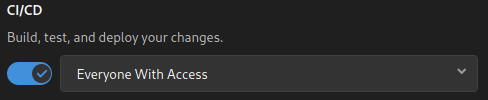
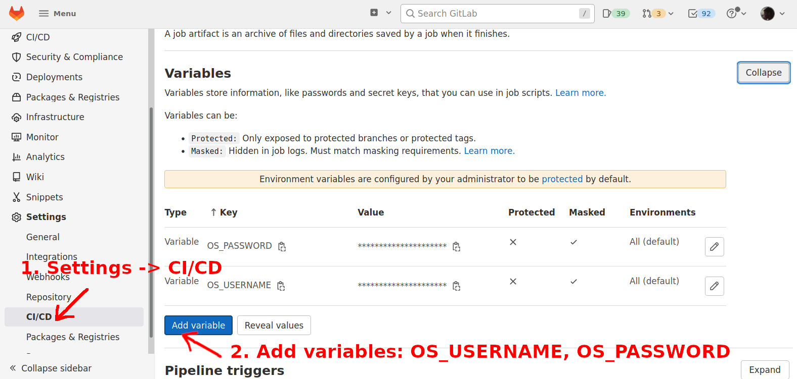

## Contributor Guidelines

- Be respectful
- Be constructive
- Be kind

## About GitLab

Exosphere is hosted on [gitlab.com](https://gitlab.com), an open-source service which is similar to GitHub in many ways. One difference is that a code contribution on GitLab is called a _merge request_ instead of a _pull request_ -- but the concept is the same, as is the contribution workflow:

1. Create your own fork of the [exosphere/exosphere](https://gitlab.com/exosphere/exosphere) project
2. On that fork project, create a branch for your work, and push one or more commits to that branch
3. Submit a merge request back to the upstream project

If you have used GitHub, this should feel familiar. If not, feel free to ask the maintainers for help. We are happy to provide an orientation.

## Submitting a Contribution (Merge Request)

When creating a merge request (MR), please begin the MR title with "Draft: " until you believe it passes the MR Quality Checklist below. When you're done, mark the MR as ready (i.e. remove the "Draft: " prefix), and it will be reviewed within one working day or so.

Maintainers are happy to provide guidance as needed, even if your MR is still in early draft status. Just ask in the Exosphere development chat. To request review from a specific person, please add them to the "Reviewers" section, leaving the MR assigned to yourself.

If your MR fixes one or more issues, please do not close them before your MR is merged. The merge should close the issues automatically.

## MR Quality Checklist

Maintainers, please ensure the MR passes this checklist before approving or merging. Consider offering to help if the contributor is new.

- All applicable sections are populated in the MR description
- MR effectively addresses all issues that it claims to fix
- MR is not a net decrease in the consistency or polish of Exosphere's UI
- MR is not a net decrease in Exosphere's code quality
- MR does not break existing functionality or behavior that users are likely to care about
- If MR adds/changes/removes widgets in `src/Style/Widgets/`, then `src/Style/StyleGuide.elm` shows example usage of that widget
- If MR adds/changes/removes app flags (in `src/Types/Flags.elm`), then the following are updated accordingly:
  - `config.js`
  - all files in `environment-configs/`, including `docker-config.js`
  - "Runtime configuration options" section in README.md
- If MR uncovers or causes any new issues worth following up on, follow-up issues are created with descriptions that refer to the MR
  - If MR introduces any technical debt, follow-up issues should be assigned to MR author

## Continuous Integration

Our continuous integration (CI) pipeline runs:

- [elm-format](https://github.com/avh4/elm-format) (to ensure that contributions comply with the   
  [Elm Style Guide](https://elm-lang.org/docs/style-guide))
- [elm-analyse](https://stil4m.github.io/elm-analyse/)
- [unit tests](tests/README.md)
- End-to-end tests which exercise the application in real web browsers 

The most frequent cause of CI pipeline failure is due to issues found by `elm-analyse`. To avoid this, please use `elm-format` and `elm-analyse` before you submit a merge request, e.g. with these commands run from the root of your repo:
 
 ```bash
 npm install
 npm run elm:format
 npm run elm:analyse
 ```

Please consider [configuring your editor](https://github.com/avh4/elm-format#editor-integration) to run `elm-format` whenever you save a file. It automatically formats your code! If you save early and often, this saves you lots of typing and indenting work.

### Enabling CI On Your Fork

Before submitting a merge request, we request that you *enable GitLab CI/CD on your fork project*. It is easier and safer for us to accept contributions that show passing tests!

1. On GitLab, go to your fork's CI/CD settings (at `https://gitlab.com/your-gitlab-username-here/exosphere/edit`)
2. Expand the "Visibility, project features, permissions" section
3. Ensure your Project Visibility is "Public"
4. Enable CI/CD for "Everyone With Access"



5. Scroll down and click "Save changes" (it's easy to miss this button)


The CI/CD pipeline should run the next time you push a commit to your fork project on GitLab. Pipeline status should be visible at `https://gitlab.com/your-gitlab-username-here/exosphere/-/pipelines`, and also in any merge request that you submit to the upstream Exosphere project.

### End-to-end browser tests

Our CI pipeline also runs end-to-end tests with real browsers.  If you are a regular contributor, we request that you enable browser tests to run from your fork project.

For these tests to work, you will need:

1. Access to a Jetstream1 allocation
2. Valid TACC (Texas Advanced Computing Center) credentials
3. Set `taccusername` and `taccpass` environment variables in the GitLab CI/CD settings of your own fork of Exosphere

If you do not have items 1 or 2, please ask the maintainers for a set of testing credentials.

Here is how to add TACC credentials as environment variables to your GitLab repository settings:



Note that the variables are _masked, but not protected_.

The next time you push a commit to your fork project, the browser tests should run in the CI pipeline.

#### Special Branch Behavior

The CI pipeline's end-to-end browser tests have special behavior for `master` and `dev` branches, as opposed to all other git repository branches.

**`master` and `dev` branches:** The CI pipeline deploys Exosphere to production environments ([try.exosphere.app](https://try.exosphere.app/) and [exosphere.jetstream-cloud.org](https://exosphere.jetstream-cloud.org/) for master branch, [try-dev.exosphere.app](https://try-dev.exosphere.app/) for dev branch), then runs the tests against these live production environments. If you are working on a fork of `exosphere/exosphere` on GitLab, these deploy jobs will not succeed (because you hopefully lack the secrets needed to deploy to production) and the tests may fail as well. So, contributors are encouraged _not_ to work on branches named `master` or `dev` at this time, even on your own fork of the project.

**All other branches:** Compiled Exosphere assets from the `elm_make` stage are combined with Selenium and a headless browser in a custom container, and the tests point at Exosphere served by this container. (See the `.build_with_kaniko`-based jobs in the `dockerize` stage.) Browser tests for merge requests run in the `test` stage along with the other tests (like Elm unit tests, `elm-analyze`, etc.). This is all self-contained within the CI pipeline; it does not use or modify live production environments.

## Architecture Decisions

We use lightweight architecture decision records. See: <https://adr.github.io/>

Our architecture decisions are documented in: [docs/adr/README.md](docs/adr/README.md)