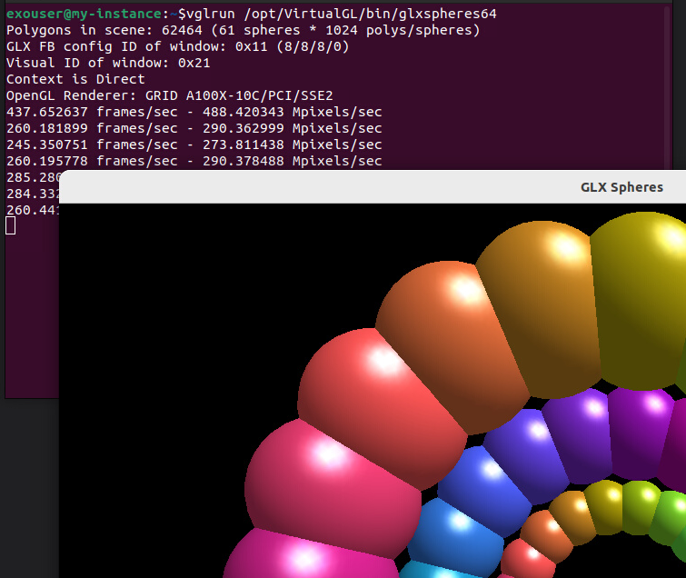
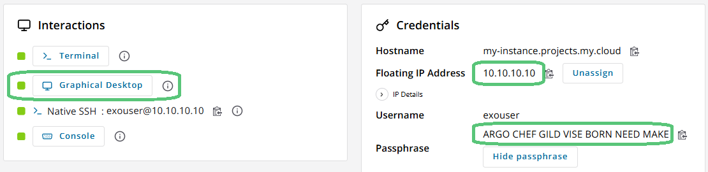
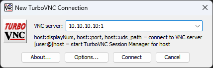
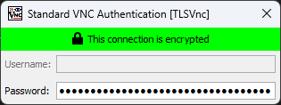
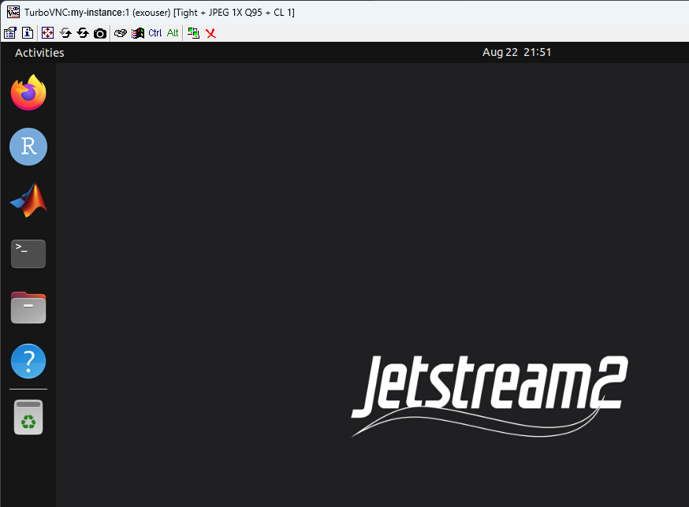

# Running Software with Graphical Acceleration

Instances launched through Exosphere are capable of an accelerated remote desktop connection, outside of the Exosphere interface. 

## Launching applications using GPU acceleration 

By default when launching an application, it will run using software rendering. Using VirtualGL it is possible to run applications on the GPU. Applications can only currently be run on the GPU when launched from the command line. 

To run an application using GPU acceleration, use `vglrun [command]`. A benchmark is available at `/opt/VirtualGL/bin/glxsphere64`

While this will work when connected using the Guacamole remote desktop opened from Exosphere, you will not see much benefit as the web viewer does not support an accelerated connection. 

## Remote Connections with TurboVNC 

TurboVNC is a remote desktop viewer supporting the VirtualGL extensions, allowing for a smooth experience when connected directly to your instance. 

### You will need

* The [TurboVNC](https://github.com/TurboVNC/turbovnc/releases/latest) Viewer

   General documentation for installing TurboVNC can be found at [https://rawcdn.githack.com/TurboVNC/turbovnc](https://rawcdn.githack.com/TurboVNC/turbovnc/main/doc/index.html#hd005001)

* An instance launched from Exosphere, with a Graphical Desktop enabled. You will need the Floating IP Address, as well as the Passphrase

   

### To connect to a running instance

1. Launch the TurboVNC Viewer, you should see "New VNC Connection"

2. In the VNC Server box, enter your instance's floating or public IP address, followed by `:1` (You may also use the instance Hostname, if available). Then press `Connect`

    

3. When prompted, enter your Passphrase, and press <kbd>Enter</kbd> 
    
    

When complete, you should see a window showing your desktop

