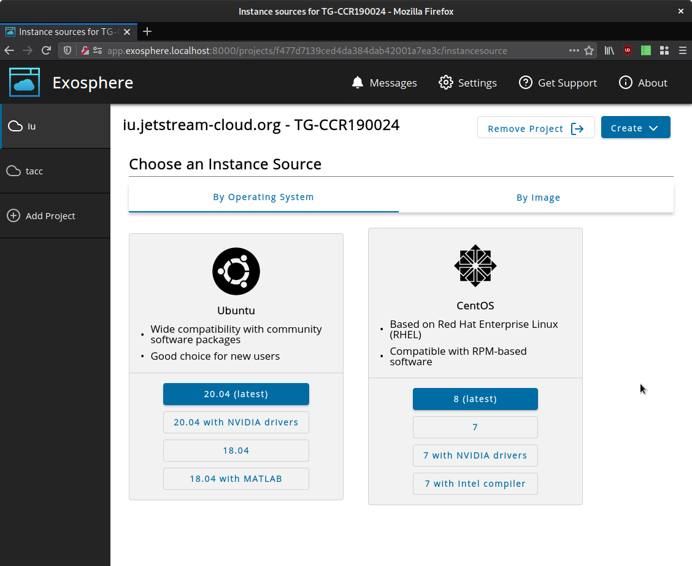

# Configuring Instance Types

Exosphere enables cloud administrators to offer an instance type selection experience. This is a user-friendly alternative to the task of browsing the list of Glance images, choosing one to launch a new instance from, and taking care to choose a flavor that is compatible with the intended workload. Instead, the user is presented with a simplified menu of instance type choices with some help text. There is still a "By image" tab for more advanced users who wish to browse the list of Glance images and choose that way instead.

Instance types can express:
- Operating systems and versions
- GPU instances, which must be launched with certain images and flavors

TODO update this screenshot?


OpenStack gives its administrators wide flexibility to choose which images and flavors you offer your users, which names and metadata those options bear, and how they are organized. Thus, Exosphere cannot _automagically_ determine what your menu of instance types should look like, or how each type should map to Glance images and flavors. In order for this nice menu to appear, you need to write it, using structured JSON. This doc will teach you how.

The instance types are defined in `config.js`, within each cloud of the `clouds` array, as an `instanceTypes` array. (See the "Runtime configuration options" section of README.md for an overview of how this works.) The overall structure of `instanceTypes` is a list of instance types, each of which contains a list of version choices. Scroll to the bottom for an example of this JSON.

Before you start writing JSON, look at the screenshot above and sketch out your menu. Which choices and versions do you want to show? Note that each instance type must have one or more version choices. Version is a flexible concept here. Exosphere will map each version 1:1 to a Glance image in your cloud (and optionally a subset of flavors), but the version doesn't need to describe the operating system release version per se. A version can also represent a variant of that operating system with particular drivers, software, or other configuration.

## instanceTypes

Each array element in `instanceTypes` is an object with the following members:

- `friendlyName` (string) is something like "Ubuntu" or "Gentoo".
- `description` (string) is text that will be displayed below the name. __Markdown is supported here!__
- `logo` (string) is a relative path to a logo to be displayed.
- `versions` is an array of versions, explained below.

## versions

Each array element in `versions` is an object with the following members:

- `friendlyName` (string) defines the label for the button. Users will click on this text.
- `isPrimary` (boolean) determines whether the button is highlighted with the primary application color. Use this to emphasize or de-emphasize a version choice.
- `imageFilters` is an object containing image filters, explained below. These filters determine which Glance image should be used when the user selects this version.
- `restrictFlavorIds` (array or null) may contain flavor IDs (string) that the user should be allowed to choose from when selecting this version.
  - If the value is null, no flavor restriction is applied. The user will be allowed to choose from all visible flavors.
  - If the value is an array and there are no matching visible flavors, the instance type version will not be shown on the menu. This allows a deployer to hide choices for flavors that a user doesn't have access to (e.g. GPU flavors). In the future, there will be a way to guide the user to request access to private flavors.
  - Note that in OpenStack, flavor IDs are strings that can look like numbers or UUIDs. Exosphere matches on an exact string, so hyphenation matters if your flavor IDs look like UUIDs.


## imageFilters

Each member of the `imageFilters` object defines a criterion that Exosphere will use to look for images. For a given version, Exosphere will only choose an image which matches _all_ filters. If there is more than one match, Exosphere will use the most recently created image. This allows you to, e.g., build and upload successive images with the same name (e.g. "Ubuntu-20-Latest"), and Exosphere will automatically use the newest one.

If there are no matching matches for the combined filtering criteria, that version will not be displayed on the menu.

- `name` (string) matches on exact image name.
- `uuid` (string) matches on image UUID. Hyphens are disregarded.
- `visibility` (string) can be one of `private`, `shared`, `community`, or `public`.
- `osDistro` and `osVersion` (string) (note casing and lack of underscore in JSON key!) matches on exact values for `os_distro` and `os_version` respectively. These are commonly used metadata properties. The [Glance Administration Guide](https://docs.openstack.org/glance/latest/admin/useful-image-properties.html#image-property-keys-and-values) documents commonly set values for them, but Exosphere is not currently restricted to this set of values.
- `metadata` (object) allows you to select for arbitrary image metadata. It accepts an object with two fields, `filterKey` and `filterValue`, both of which have string values.

Suggestion, use only the image filters that you need to ensure the right image is selected. It would be crazy to use all them at the same time for a given version. Still, as an illustration, here is an example of _all_ filters.

```
"imageFilters":{
  "name":"JS-API-Featured-Ubuntu20-NVIDIA-Latest",
  "uuid":"5ca1ab1e-f00d-caf0-beef-50de1ec7ab1e",
  "visibility":"public",
  "osDistro":"ubuntu",
  "osVersion":"20.04",
  "metadata":{
    "filterKey":"is-on-the-menu",
    "filterValue":"true"
  }
}
```

## Example instanceTypes JSON

```javascript
var config = {
  ...
  "clouds":[
    {
      "keystoneHostname":"iu.jetstream-cloud.org",    
      ...  
      "instanceTypes":[
        {
          "friendlyName":"Ubuntu",
          "description":"Wide compatibility with community software packages, good choice for new users",
          "logo":"assets/img/ubuntu.svg",
          "versions":[
            {
              "friendlyName":"20.04 (latest)",
              "isPrimary":true,
              "imageFilters":{
                "name":"JS-API-Featured-Ubuntu20-Latest",
                "visibility":"public"
              },
              "restrictFlavorIds":null
            },
            {
              "friendlyName":"20.04 with GPU",
              "isPrimary":false,
              "imageFilters":{
                "name":"JS-API-Featured-Ubuntu20-NVIDIA-Latest",
                "visibility":"public"
              },
              "restrictFlavorIds":[
                "24",
                "25",
                "26",
                "27",
                "28",
                "29",
                "30",
                "31"
              ]
            },
            {
              "friendlyName":"18.04",
              "isPrimary":false,
              "imageFilters":{
                "name":"JS-API-Featured-Ubuntu18-Latest",
                "visibility":"public"
              },
              "restrictFlavorIds":null
            },
            {
              "friendlyName":"18.04 with MATLAB",
              "isPrimary":false,
              "imageFilters":{
                "name":"JS-API-Featured-Ubuntu18-MATLAB-Latest",
                "visibility":"public"
              },
              "restrictFlavorIds":null
            }
          ]
        },
        {
          "friendlyName":"CentOS",
          "description":"Based on Red Hat Enterprise Linux (RHEL), compatible with RPM-based software",
          "logo":"assets/img/centos.svg",
          "versions":[
            {
              "friendlyName":"8 (latest)",
              "isPrimary":true,
              "imageFilters":{
                "name":"JS-API-Featured-CentOS8-Latest",
                "visibility":"public"
              },
              "restrictFlavorIds":null

            },
            {
              "friendlyName":"7",
              "isPrimary":false,
              "imageFilters":{
                "name":"JS-API-Featured-CentOS7-Latest",
                "visibility":"public"
              },
              "restrictFlavorIds":null
            },
            {
              "friendlyName":"7 with GPU",
              "isPrimary":false,
              "imageFilters":{
                "name":"JS-API-Featured-CentOS7-NVIDIA-Latest",
                "visibility":"public"
              },
              "restrictFlavorIds":[
                "24",
                "25",
                "26",
                "27",
                "28",
                "29",
                "30",
                "31"
              ]
            },
            {
              "friendlyName":"7 with Intel compiler",
              "isPrimary":false,
              "imageFilters":{
                "name":"JS-API-Featured-CentOS7-Intel-Developer-Latest",
                "visibility":"public"
              },
              "restrictFlavorIds":null
            }
          ]
        }
      ]
    }
  ]
}
```
