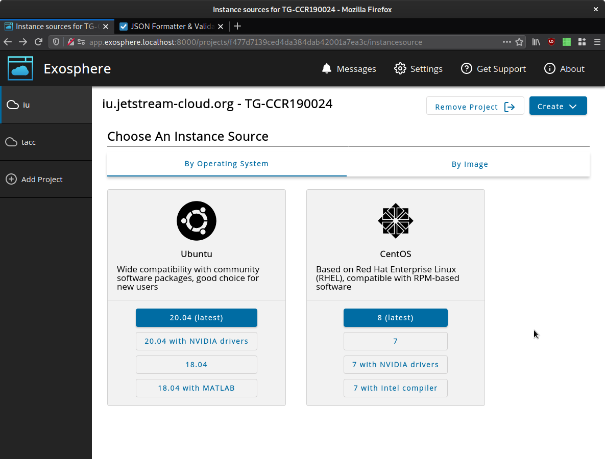

# Configuring Operating System Choices

(Style note for this doc: "OpenStack" and "Operating System" both overload the same acronym: OS. For the sake of clarity, it is _forbidden_ to use "OS" here.)

Exosphere now enables cloud administrators to offer an operating system selection experience. This is a user-friendly alternative to the task of browsing the list of Glance images and choosing one to launch a new instance from. Instead, the user is presented with a simplified menu of operating system + version choices, with some help text. There is still a "By image" tab for more advanced users who wish to browse the list of Glance images and choose one that way instead.



As an OpenStack administrator, you have wide flexibility to choose which images you offer your users, which names and metadata those images get, and how they are organized. Thus, Exosphere cannot _automagically_ determine what your menu of operating system choices should look like, or how each choice should map to a Glance image. In order for this nice menu to appear, you need to write it, using structured JSON. This doc will teach you how.

The operating system choices are defined in `config.js`, within each cloud of the `clouds` array, as an `operatingSystemChoices` array. (See the "Runtime configuration options" section of README.md for an overview of how this works.) The overall structure of `operatingSystemChoices` is a list of operating systems, each of which contains a list of operating system version choices. Scroll to the bottom for an example of this JSON.

Before you start writing JSON, look at the screenshot above and sketch out your menu. Which operating systems and versions do you want to show? Observe that _version_ is a flexible concept here. Exosphere will map each version 1:1 to a Glance image in your cloud, but the version doesn't need to describe _only_ the operating system release version per se, like 8.2 or 20.04. A version can also represent a variant of that operating system with particular drivers, software, or other configuration.

## operatingSystemChoices

Each array element in `operatingSystemChoices` is an object with the following members:

- `friendlyName` (string) is something like "Ubuntu" or "Gentoo".
- `description` (string) is text that will be displayed below the name. __Markdown is supported here!__
- `logo` (string) is a relative path to a logo to be displayed.
- `versions` is an array of versions, explained below.

## versions

Each array element in `versions` is an object with the following members:

- `friendlyName` (string) defines the label for the button. Users will click on this text.
- `isPrimary` (boolean) determines whether the button is highlighted with the primary application color. Use this to emphasize or de-emphasize a version choice.
- `filters` is an object containing filters, explained below. These filters determine which Glance image should be used when the user selects this version.

## filters

Each member of the `filters` object defines a criterion that Exosphere will use to look for images. For a given version, Exosphere will only choose an image which matches _all_ filters. If there is more than one match, Exosphere will use the most recently created image. This allows you to, e.g., build and upload successive images with the same name (e.g. "Ubuntu-20-Latest"), and Exosphere will automatically use the newest one.

If there are no matching matches for the combined filtering criteria, that version will not be displayed on the menu.

- `name` (string) matches on exact image name.
- `uuid` (string) matches on image UUID. Hyphens are disregarded.
- `visibility` (string) can be one of `private`, `shared`, `community`, or `public`.
- `osDistro` and `osVersion` (string) (note casing and lack of underscore in JSON key!) matches on exact values for `os_distro` and `os_version` respectively. These are commonly used metadata properties. The [Glance Administration Guide](https://docs.openstack.org/glance/latest/admin/useful-image-properties.html#image-property-keys-and-values) documents commonly set values for them, but Exosphere is not currently restricted to this set of values.
- `metadata` (object) allows you to select for arbitrary image metadata. It accepts an object with two fields, `filterKey` and `filterValue`, both of which have string values.

Suggestion, use only the filters that you need to ensure the right image is selected. It would be crazy to use all them at the same time for a given version. Still, as an illustration, here is an example of _all_ filters.

```
"filters":{
  "name":"JS-API-Featured-Ubuntu20-NVIDIA-Latest",
  "uuid":"5ca1ab1e-f00d-caf0-beef-50de1ec7ab1e",
  "visibility":"public",
  "osDistro":"ubuntu",
  "osVersion":"20.04",
  "metadata":{
    "filterKey":"is-on-the-menu",
    "filterValue":"true"
  }
}
```

## Example operatingSystemChoices JSON

```javascript
var config = {
  ...
  "clouds":[
    {
      "keystoneHostname":"iu.jetstream-cloud.org",    
      ...  
      "operatingSystemChoices":[
        {
          "friendlyName":"Ubuntu",
          "description":"Wide compatibility with community software packages, good choice for new users",
          "logo":"assets/img/ubuntu.svg",
          "versions":[
            {
              "friendlyName":"20.04 (latest)",
              "isPrimary":true,
              "filters":{
                "name":"JS-API-Featured-Ubuntu20-Latest",
                "visibility":"public"
              }
            },
            {
              "friendlyName":"20.04 with NVIDIA drivers",
              "isPrimary":false,
              "filters":{
                "name":"JS-API-Featured-Ubuntu20-NVIDIA-Latest",
                "visibility":"public"
              }
            },
            {
              "friendlyName":"18.04",
              "isPrimary":false,
              "filters":{
                "name":"JS-API-Featured-Ubuntu18-Latest",
                "visibility":"public"
              }
            },
            {
              "friendlyName":"18.04 with MATLAB",
              "isPrimary":false,
              "filters":{
                "name":"JS-API-Featured-Ubuntu18-MATLAB-Latest",
                "visibility":"public"
              }
            }
          ]
        },
        {
          "friendlyName":"CentOS",
          "description":"Based on Red Hat Enterprise Linux (RHEL), compatible with RPM-based software",
          "logo":"assets/img/centos.svg",
          "versions":[
            {
              "friendlyName":"8 (latest)",
              "isPrimary":true,
              "filters":{
                "name":"JS-API-Featured-CentOS8-Latest",
                "visibility":"public"
              }
            },
            {
              "friendlyName":"7",
              "isPrimary":false,
              "filters":{
                "name":"JS-API-Featured-CentOS7-Latest",
                "visibility":"public"
              }
            },
            {
              "friendlyName":"7 with NVIDIA drivers",
              "isPrimary":false,
              "filters":{
                "name":"JS-API-Featured-CentOS7-NVIDIA-Latest",
                "visibility":"public"
              }
            },
            {
              "friendlyName":"7 with Intel compiler",
              "isPrimary":false,
              "filters":{
                "name":"JS-API-Featured-CentOS7-Intel-Developer-Latest",
                "visibility":"public"
              }
            }
          ]
        }
      ]
    }
  ]
}
```
