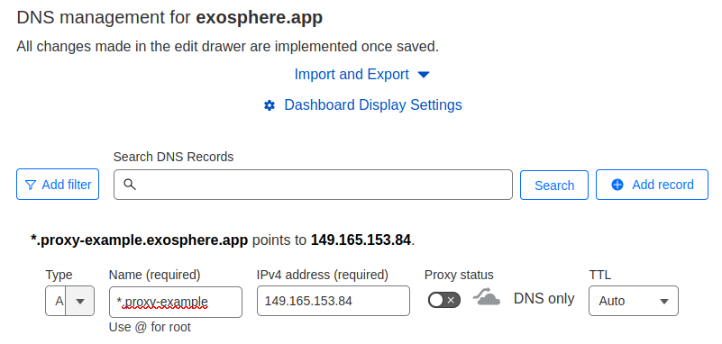
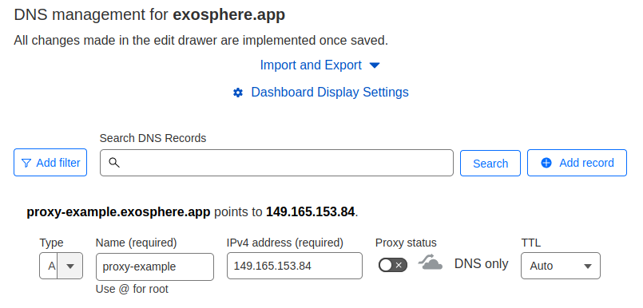

# Deploying and Maintaining Exosphere in Production

This guide is for a cloud operator who wants to offer a full-featured and customized deployment of Exosphere to their own user community. This process requires some Linux systems administrator know-how, though it may become simpler in the future.

For purposes of evaluating Exosphere, consider two simpler alternatives:

- Using [try.exosphere.app](https://try.exosphere.app), a production deployment that the upstream project already hosts. The biggest limitations are that you cannot edit the app's configuration, you cannot use your own User Application Proxy (UAP) server, and you are trusting us to proxy connections to your cloud's APIs on behalf of your users.
- [Running Exosphere locally](run-exosphere.md) on your computer. This is a good approach for development and evaluation purposes, but it requires either `npm` or Docker setup on each device.

If neither of these approaches meet your needs, you're reading the right guide.

## Architecture of Deployment

To provide access to a single-region OpenStack deployment, we recommend two logical servers. For a multi-region OpenStack deployment, we recommend an additional User Application Proxy in each additional region. It's possible to accomplish this with a greater or smaller number of servers, but those scenarios are not covered by this guide.

| **Aspect**            | **Main Server**              | **User Application Proxy (UAP) Server** |
|-----------------------|------------------------------|-----------------------------------------|
| Quantity required     | One                          | One per OpenStack region                |
| Serves static content | Exosphere client application | None                                    |
| Reverse proxy role    | Cloud CORS Proxy (CCP)       | User Application Proxy (UAP)            |
| Network locality      | Can reach OpenStack APIs     | Can reach instance IPs                  |
| TLS Certificate       | Single-domain certificate    | Wildcard certificate                    |
| Optional components   | OpenID Connect Redirector    | None                                    |

The main server runs Nginx to serve the Exosphere web application and provide the [Cloud CORS Proxy](solving-cors-problem.md). It optionally runs the [OpenID Connect Redirector](federated-login.md). You only need one of these servers, even if you have multiple OpenStack clouds or regions. It needs to be accessible via the network to your users' web browsers, and it must also have network connectivity to your OpenStack APIs.

The UAP server runs Nginx to provide the [User Application Proxy](user-app-proxy.md). This server must be able to make connections to instances running on your cloud (via their floating or fixed IPs). Optimally, the UAP is an OpenStack instance on the same public Neutron segment as your instances.

*The only server-side software* involved is: Nginx and possibly certbot (if you use Let's Encrypt). There is no other back-end code and no server-side database. This is unlike most other web applications.

These servers can be virtual machines on your OpenStack cloud, containers, or bare metal. They do not need to be large -- start with a couple of CPU cores and a few GB of RAM.

## Prerequisites

First, review [Exosphere Compatibility](compatibility.md) to ensure that your OpenStack cloud will work with Exosphere.

### Hostnames

This guide assumes you have set up a hostname and public DNS resolution for each server. As placeholders, we use:

- `my-example.exosphere.app` for the main server
- `proxy-example.exosphere.app` for the UAP

### TLS Certificates

To complete the deployment, you'll need to obtain at least two TLS certificates that your users' browsers will accept. The upstream Exosphere project obtains certificates from [Let's Encrypt](https://letsencrypt.org), and this guide will walk you through the same. (You can use any other certificate authority, including your own, but this guide does not cover those scenarios.)

The main server only needs a simple certificate for a single domain. The deployment steps below will automatically obtain this certificate for you.

Each UAP requires a [wildcard certificate](https://en.wikipedia.org/wiki/Wildcard_certificate). (Read [here](user-app-proxy.md) for more information about why.) Obtaining a wildcard certificate from Let's Encrypt requires more setup work than a single-domain certificate, because you must use the [DNS-01 challenge](https://letsencrypt.org/docs/challenge-types/#dns-01-challenge). DNS validation requires you to use a compatible DNS provider; the DNS provider must offer an API for your certbot client to create and update TXT records. (The Let's Encrypt community maintains [this list](https://community.letsencrypt.org/t/dns-providers-who-easily-integrate-with-lets-encrypt-dns-validation/86438) of compatible DNS providers.) This guide covers wildcard certificate setup using Cloudflare as a DNS provider.

## Deployment Steps

We tested this process with Ubuntu 22.04 instances, 1 CPU core, 3 GB of RAM, and 20 GB of root disk space. You can get by with even smaller. Operating systems other than Ubuntu will also work, but the steps may be slightly different, and they are not covered here.

### Main Server

Create a new server instance, and ensure you can reach the server at its hostname (e.g. `ping my-example.exosphere.app`).

Next, install docker-compose if it's not already installed.

```
sudo apt install docker-compose
```

Next, clone the Exosphere repository down to the server.

```
git clone https://gitlab.com/exosphere/exosphere.git
cd exosphere
```

Next, open `config.js` in your preferred editor. Set `cloudCorsProxyUrl` to `/proxy`, and save the file. The line should look like this.

```
  cloudCorsProxyUrl: "/proxy",
```

This will cause Exosphere to use the Cloud CORS Proxy server included with your deployment, rather than one maintained by the upstream project. No other configuration changes are required at this point. We suggest getting the site working, then iteratively customizing the configuration afterward.

Next, run `build.sh`, and accept the `npm` package installation (press enter) if prompted. This will compile the Elm app, then copy the compiled and static assets to a `public` directory. (This `public` directory will be the document root of the web server. Nginx will serve content from there.)

```
./deploy/prod/main-server/build.sh
```

Next, `cd` to `deploy/prod/main-server`.

Next, edit `docker-compose.yml`, changing `NGINX_HOSTNAME` to the public hostname of your server.

Next, edit `init-letsencrypt.sh`. Set the `domains` variable to the public hostname of your server, and provide an email address in the `email` variable.

Finally, start the docker-compose stack. Two different ways.
- If you are starting it for the first time, run `sudo ./init-letsencrypt.sh`. This will obtain your first TLS certificate and start the containers. (The certificate will auto-renew.)
- If you have already ran `init-letsencrypt.sh` at least once, you can just start the containers with `docker-compose up -d`.

#### Test initial deployment

Browse to your instance's public hostname (e.g. `https://my-example.exosphere.app`). If everything went well, you'll see the Exosphere web application. Try logging into a cloud!

#### Customize the configuration

You can edit `config.js` and `cloud-configs.js` according to the documented [Configuration Options](config-options.md). When you save a change to these files, run `build.sh` again, and it will copy your changes to the web server document root. These changes apply to the live application as soon as you refresh your web browser. There is no need to reload Nginx.

### User Application Proxy (UAP)

This assumes you're using Cloudflare to provide DNS for your domain.

#### DNS Validation Setup in Cloudflare Dashboard

Log into the Cloudflare dashboard and [create an API token](https://developers.cloudflare.com/fundamentals/api/get-started/create-token). It only needs the permission "Zone / DNS / Edit" for the zone that you're using (like `exosphere.app`). Copy the secret API token for later entry.

Next, ensure that you have two DNS records, one with a wildcard hostname (e.g. `*.proxy-example`), and one with the non-wildcard version of the hostname (e.g. `proxy-example`). Both of these should point to the public IP address of your UAP server:





#### Server setup

Create a new server instance, and ensure you can reach the server at its hostname (e.g. `ping proxy-example.exosphere.app`).

Next, install some software on it.

```
sudo apt install nginx python3-certbot-nginx python3-certbot-dns-cloudflare
```

On the instance, create a file to hold the Cloudflare API token.

```
sudo touch /root/cloudflare-secret.ini
sudo chmod 600 /root/cloudflare-secret.ini
```

Open it with your editor and paste the following line. Replace the value with your actual API key that you generated earlier. Save the file.

```
dns_cloudflare_api_token = replace-me-with-your-secret-token
```

#### Generate wildcard certificate

Next, run certbot to generate a certificate. Replace the hostnames in the `-d` argument with your own UAP's hostname.

```
sudo certbot certonly \
--dns-cloudflare \
--dns-cloudflare-credentials /root/cloudflare-secret.ini \
--dns-cloudflare-propagation-seconds 30 \
--email you@example.com \
--agree-tos \
--no-eff-email \
-d *.proxy-example.exosphere.app \
-d proxy-example.exosphere.app
```

When it completes, ensure that you have a certificate stored in `/etc/letsencrypt/live`.

Next, set up Let's Encrypt to reload Nginx each time the certificate renews. In `/etc/letsencrypt/renewal-hooks/deploy`, create a tiny script and make it executable:

```
sudo touch /etc/letsencrypt/renewal-hooks/deploy/reload-nginx.sh
sudo chmod +x /etc/letsencrypt/renewal-hooks/deploy/reload-nginx.sh
```

Open it with your editor, paste the following contents, and save it:

```
#!/bin/bash

systemctl reload nginx
```

#### Configure Nginx

Delete any files in `/etc/nginx/sites-enabled/` on your server, then copy `deploy/prod/uap/app.conf` from this repository to that same directory.

In this file, replace:

- Instances of `my-example.exosphere.app`, with the hostname of your _main server_ (not the UAP)
- Instances of `proxy-example.exosphere.app`, with the hostname of your UAP
- Instances of `proxy-example\.exosphere\.app`, with the hostname of your UAP, with any periods escaped (as this is part of a regular expression)
- The three regular expressions that match hostnames containing IP addresses, according to the floating IP subnet(s) available to instances on your cloud.
  - The example file allows traffic for `192.168.0.0/24`; you will likely need to modify this.
- The `proxy_pass` directive, according to your floating IP subnet(s)
- The values of `ssl_certificate` and `ssl_certificate_key`, according to your actual files in `/etc/letsencrypt/live/`.

Finally, do a `systemctl restart Nginx`. Ensure that the service restarted without error and is running.

Now that your UAP is deployed, configure Exosphere to use it.

#### Configure Exosphere to use your Proxy Server

Back on your main server, where you cloned the Exosphere repository, edit `cloud-configs.js`.

Add a JSON object to the `clouds` array for your OpenStack cloud, in which you define a `userAppProxy` for each region. See [Configuration Options](config-options.md) and [User Application Proxy](user-app-proxy.md) for more information.  A minimal `clouds` array object which accomplishes this is:

```
    {
      keystoneHostname: "your-keystone.example.com",
      friendlyName: "Your Cloud",
      userAppProxy: [
        {
          region: null,
          hostname: "proxy-example.exosphere.app",
        },      
      ],
      imageExcludeFilter: null,
      featuredImageNamePrefix: null,
      instanceTypes: [],
      flavorGroups: [],
      desktopMessage: null,
    },
```

Then, from the root of the repository, re-run `build.sh` to copy your changes to the document root of the web server.

```
./deploy/prod/main-server/build.sh
```

Next, test your UAP server. Create an instance on your cloud (with Guacamole enabled). Wait for it to deploy. Once deployment completes, if everything worked, you should be able to open the Web Shell from the instance details page.

If it doesn't work, time to troubleshoot! If you need troubleshooting help, feel free to ask on Exosphere's community chat.

## Maintaining Your Production Deployment

There are approximately three maintenance activities: updating system packages on the production servers, updating the containers on the main server, and updating Exosphere with the latest upstream 
code changes. All of these things can happen independently of each other.

## Updating Hosts

For Ubuntu, this is as simple as `apt update`, `apt dist-upgrade`, then rebooting the server if needed. (Obviously, rebooting will cause an outage for users of your Exosphere service.)

### Updating Containers on Main Server

This task updates Nginx and certbot in their respective containers. `cd` to the `deploy/prod/main-server` directory in your Exosphere repository, then run the docker-compose command that pulls new containers:

```
docker-compose pull
```

This may cause a _momentary_ disruption for users as Nginx is restarted, but they may not notice.

### Updating Exosphere

This updates the Exosphere code itself, bringing in new features and bug fixes.

On your main server, `cd` to where you cloned the Exosphere repository. From there, generally, you can run `git pull` to bring in changes from the upstream project. If you cloned Exosphere from your own fork repository, the correct git command(s) may be different. (Feel free to ask for help in Exosphere chat.)