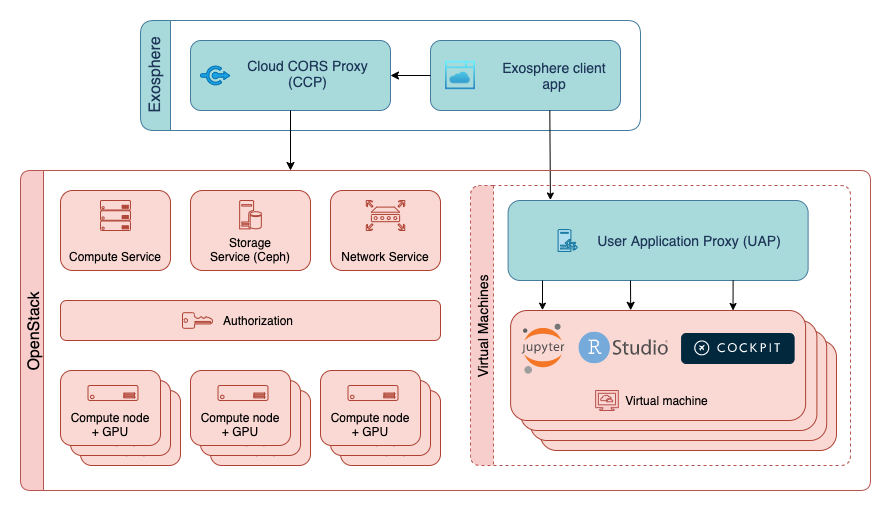

# User Application Proxy (UAP)

## Overview

The User Application proxy (UAP) facilitates encrypted, server-authenticated connections between the Exosphere client and web-based services that are hosted on users' cloud instances. These web services include Guacamole for shell and streaming desktop sessions, and data science workbenches like JupyterLab and RStudio Server. In order to securely deliver these services to the user's web browser, they must be served using Transport Layer Security (TLS) with an x.509 certificate that has been signed by a certificate authority like Let's Encrypt. For reasons detailed below in "Background" section, it appears infeasible to obtain a CA-signed cert for each server that a user creates in an automatic and scalable way. UAP is a solution to this problem: it re-terminates TLS connections between users and instance-hosted web applications at each OpenStack cloud using a wildcard certificate from Let's Encrypt.



URL parts diagram showing how a client connects to a service running :
```
https://http-198-51-100-99-12345.myexampleproxy.example.com/foobar
        \___/\___________/ \___/ \________________________/ \____/
          |        |         |               |                |
          |    upstream     port  hostname of proxy server    |
          |   instance IP                                     |
          |                                                   |
    optional upstream protocol, defaults to https             |
                                                              |
                Entire URL path is passed along to the instance
```


## Security/Threat Model

In a properly configured OpenStack deployment, Neutron and its supporting technologies (ebtables and iptables) protect IP traffic between the UAP and cloud instances, as long as the UAP and instances are on the same Neutron network. This prevents the upstream connection from being intercepted or modified.  At this time, Exosphere is not deploying upstream services (like Guacamole) to serve TLS to the UAP, though this may change in the future.

Until upstream connections between UAP and instances use TLS, a dedicated UAP must be deployed at each OpenStack cloud, on the same public Neutron networks(s) as instances. Fortunately, a UAP is simple to deploy and maintain.

## How to set up a UAP in your cloud

A UAP is just Nginx with a specific configuration. The example Nginx configuration below implements a UAP for an OpenStack deployment whose instances are assigned public IP addresses in the range `198.51.100.0/24`. The UAP's hostname is myexampleproxy.example.com. Note that you must also set up a wildcard DNS entry for your UAP's hostname, obtain a wildcard certificate (perhaps using Let's Encrypt), and configure Nginx to use it. Those steps are not shown here, but the Exosphere developers are happy to assist with this process (which will likely also result in better documentation).

```
map $host $proto {
    default https;
    "~*(^(http|https)-198-51-100-(\d+)-(\d+)\.proxy-j7m-iu\.exosphere\.app$)" $2;
}

# Fourth octet can be 0 to 255
map $host $octet4 {
    "~*(^(http-|https-)?198-51-100-([0-9]|[1-9][0-9]|1[0-9][0-9]|2[0-4][0-9]|25[0-5])-(\d+)\.proxy-j7m-iu\.exosphere\.app$)" $4;
}

# Port can be whatever
map $host $port {
    "~*(^(http-|https-)?198-51-100-(\d+)-(\d+)\.proxy-j7m-iu\.exosphere\.app$)" $5;
}

server {
        server_name *.myexampleproxy.example.com;
        location / {
                proxy_pass $proto://198.51.100.$octet4:$port;
                proxy_ssl_verify off;
                proxy_set_header Host $host;
                proxy_set_header X-Forwarded-Proto $scheme;
        }

        # Nginx has a default file upload size of 1 megabit, consider increasing this to allow users to upload larger files
        client_max_body_size 10G;
}

```

## How to configure Exosphere to know about a new UAP

In order for Exosphere to deploy instances with Guacamole support on a given cloud, Exosphere must know about a UAP at that cloud. UAPs known to Exosphere are configured in `ports.js`, as a list item in the `clouds` flag. This flag is passed to Exosphere on startup.

The `clouds` flag is a list containing JSON objects for each cloud with a custom configuration. Each of these JSON objects contains `keystoneHostname` and `userAppProxy` properties (amongst others). `keystoneHostname` is the hostname of the Keystone API for a given OpenStack cloud, and `userAppProxy` is the hostname of the UAP.

Known UAPs are already configured in `cloud_configs.js` on the master branch of Exosphere. If you operate an OpenStack cloud, you may wish to add an entry for your UAP to the master branch, so that everyone can benefit from using it; feel free to submit a merge request.

## Background

For more context of how this solution was explored, see [issue 381](https://gitlab.com/exosphere/exosphere/-/issues/381) in the Exosphere project on GitLab.

### Problem Statement

Exosphere relies on a rich ecosystem of free, open-source software services to provide users with rich interactivity to their cloud servers (a.k.a. instances). A few important examples of these:

- [Apache Guacamole](http://guacamole.apache.org/), which allows users to access their servers with a remote terminal and graphical desktop environment, all from their web browser
- [JupyterLab](https://jupyter.org/), which is not tightly integrated with Exosphere yet but is already used in the community of Exosphere users. (Several other data science tools and workbenches are also in this category.) 

What do these share in common? They are all web-based services. In the Exosphere ecosystem, they are all served from a user's cloud _server_ (a.k.a. instance) and accessed in the user's web browser (the _client_).

In order to serve a web-based service in a way that is reasonably secure and reliable, we must configure Transport Layer Security (TLS) on the _server_ end of the connection, and this is a challenge in the Exosphere ecosystem. To understand why, a high-level understanding of TLS is needed; skim or skip the following lesson if you don't need it.

### Brief TLS Lesson

Web browsers use [Transport Layer Security](https://en.wikipedia.org/wiki/Transport_Layer_Security) (TLS) to perform two critically important jobs: **confidentiality** and **server authentication**. Confidentiality assures you that the communication between browser and server is encrypted and cannot be intercepted or manipulated in transit. Server authentication assures you that the site/server you're connecting to at abc.com is actually the server which abc.com resolves to, and not an impostor ["man in the middle"](https://en.wikipedia.org/wiki/Man-in-the-middle_attack) that's trying to pose as the server in order to steal sensitive information from the user.

To this end, a modern web browser has several restrictions regarding the kinds of connection it will make (and deem secure). Among these, it will only make a secure TLS connection to a site that presents a valid [server certificate](https://en.wikipedia.org/wiki/Public_key_certificate#TLS/SSL_server_certificate), and this certificate must be signed by one of a trusted set of [certificate authorities](https://en.wikipedia.org/wiki/Certificate_authority) (CAs). It is the CA's job to verify that the party requesting a certificate actually controls the server for the website that they wish to serve secure content for (e.g. abc.com). This is the basis of trust for the "server authentication" aspect of TLS[^tlsdisclaimer]. In other words, your browser will make secure (`https://`) connections to any server which presents a TLS certificate that was signed by a certificate authority that the browser trusts, and is valid for the hostname that the browser is connecting to. Any other type of `https://` connection will fail, by design, because it's not actually secure! In some cases the browser will warn the user that server's identity cannot be verified, and allow you to load the site after adding a security exception for it. But generally, such a connection should not be trusted with any sensitive information (like passwords).

Therefore, the cloud servers that are launched by Exosphere users must possess a valid server certificate signed by a browser-trusted CA (a "CA-signed cert" for short), in order to directly serve Guacamole, JupyterLab, and other services with sufficient security.

### End of TLS Lesson

**It appears infeasible to obtain a CA-signed cert for each server that a user launches, or at least infeasible on a large scale, and another solution is needed.**

To understand why, let's look at what's needed in order to obtain a CA-signed cert. This used to be a costly, manual process: you would pay a fee to a CA (like DigiCert or GoDaddy), then complete some manual challenge to prove that you own the hostname(s) that the certificate should be valid for. Then, the CA would send you the signed certificate. Fortunately, [Let's Encrypt](https://letsencrypt.org) has made this process free and automatic since late 2015. Let's Encrypt is great for many use cases, but it doesn't quite solve this problem. Let's Encrypt has a set of policy limitations which seem to make our use of it infeasible at scale (i.e. obtaining a certificate for each user-launched instance).

In brief: Let's Encrypt does not issue certificates for public IP addresses, only for DNS hostnames. When an Exosphere user launches an instance, that instance might only have an IP address. Obtaining a public hostname requires adding a host record to a domain, like mynewinstance.examplecloud.com. Exosphere generally won't have the ability to do this for users, though some OpenStack cloud operators (CyVerse and Jetstream) pre-create hostnames for their entire public IP address space, and services like [xip.io](http://xip.io/) also provide hostname coverage. Unfortunately, a hostname for each public IP address doesn't quite get us there, because Let's Encrypt also imposes [rate limits](https://letsencrypt.org/docs/rate-limits/) on certificate issuance per domain.

Under these rate limits, the only way to obtain a certificate for hundreds of hostnames per domain is to batch them, i.e. make each certificate valid for many hostnames (with each hostname corresponding to one public IP address or one cloud server). This would cause a security problem, because the certificates for different users' instances would share the same private key, which may allow one user to impersonate another user's instance to decrypt traffic and intercept sensitive information.  The only apparent workaround for these rate limits is to register many domains (one per public IP address), but this is costly (because registering a domain requires a yearly fee), thus it would not scale for an open-source software project.

The current UAP solution centralizes the work of terminating TLS to one sever for an entire cloud. This server is maintained by that cloud's operator (or by the Exosphere team) and it provides secure connections for all instances running on that cloud.

## Footnotes

[^tlsdisclaimer]: The Certificate Authority system is far from foolproof, and the possibility of [compromising a CA](https://en.wikipedia.org/wiki/Certificate_authority#CA_compromise) is the weak link in this arrangement, but that is beyond the scope of what Exosphere currently tries to accomplish.
